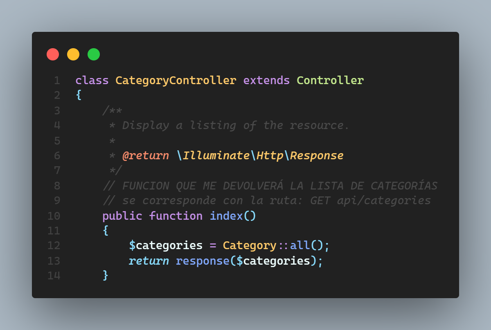

# BSALE-TEST-BACKEND
## Documentación de Backend

Para realizar el API Rest se usó como framework de backend a LARAVEL. A continuación de explica de manera resumida lo que se realizó:

1. Para empezar se crearon las rutas tanto para manejar a los productos y a las categorías, estas se encuentran en el archivo *'api.php'* (dentro de carpeta routes). Este es el punto donde empieza todo, por así decirlo, ya que estas rutas son las que finalmente serán usadas por mi cliente para consumir los datos. A continuación las rutas que se crean:
    - Rutas para las categorías

El código anterior crea todo esto:

    - Rutas para los productos

El código anterior crea todo esto:

    - NOTA: Ya que esta prueba no necesita manejar todo un CRUD completo, solo se utilizaron las rutas que traen la lista tanto de productos como de categorías, y la ruta extra para traer los productos de acuerdo a una categoría.

2. Además de esto se creo una ruta extra para obtener los productos de acuerdo a una categoría (ruta *category/{category}*).
    
    El código anterior dará como resultado:
    

3. Se creó los modelos para los productos y categorías (*Product* y *Category* respectivamente, dentro de la carpeta *app/Models*).
    - Product Model:
    
    - Category Model:
    

4. Los modelos mencionados en el punto anterior son necesarios para que los controlares *ProductController* y *CategoryController* (dentro de app/Http/Controllers) puedan interactuar con la base de datos. Lo que esta dentro de los controladores simplemente es lógica de programación.
    - Un punto a tener en cuenta es que no he usado todos los métodos dentro de los controladores, ya que no se pide realizar un crud completo para esta prueba.

    - *Product Controller*
    
    - *Category Controller*
    

5. Para realizar el filtro de búsqueda que se pide para los productos, hice uso Eloquent ORM de Laravel, usando su método *'where()'* y haciendo un filtrado de acuerdo a lo que viene como un query param desde el cliente (ver método *'index'* en el *ProductController*); además allí mismo también se realizó la paginación de los productos, gracias al método *'paginate()'* que nos ofrece Laravel.

6. Y por último también vale la pena mencionar que la conexión a la base de datos se encuentra dentro del archivo *'database.php'* (dentro de la carpeta *config*).
    - DB Connection
    
    Esta conexión toma como base las variables de entorno que se encuentran en el archivo *'.env'*
    
    
7. Eso sería todo lo que se realizó para crear el API rest, finalmente esta fue subida a Heroku, bajo el dominio:
    [https://sleepy-chamber-15932.herokuapp.com/](https://sleepy-chamber-15932.herokuapp.com/)
    - Endpoint para obtener la lista de productos: [https://sleepy-chamber-15932.herokuapp.com/](https://sleepy-chamber-15932.herokuapp.com/api/products)
    - Endpoint para obtener la lista de categorías: [https://sleepy-chamber-15932.herokuapp.com/](https://sleepy-chamber-15932.herokuapp.com/api/categories)
    - Endpoint para obtener los productos de acuerdo a un id de categoría (en este caso al id 1 de la categoría 'bebida energética'): [https://sleepy-chamber-15932.herokuapp.com/](https://sleepy-chamber-15932.herokuapp.com/api/category/1)
